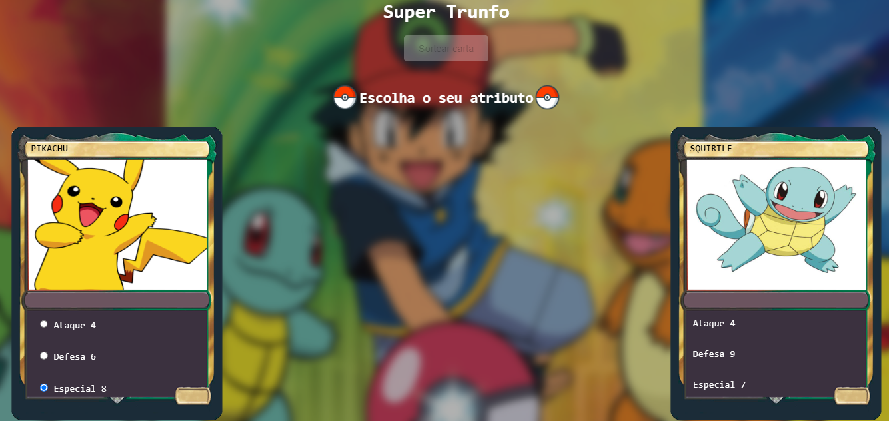

# Supertrunfo de Cartas Pokémon

>imersão dev Alura

## Índice
- [Imagem do Projeto](#imagem-do-projeto)

- [Repositório do Projeto](#repositório-do-projeto)

- [Tecnologias](#tecnologias-&#x1f4bb;)

- [O que aprendi](#o-que-aprendi)

- [Contato](#contato-&#x1F4E7;)

## Imagem do Projeto

Projeto construído como desafio no módulo de CSS Avançado do curso de Front-end do DEVQUEST.

## Repositório do Projeto

[&#x1F517; Clique aqui para acessar o projeto](https://github.com/alysson-leite/landing-page-com-grid)

## Tecnologias &#x1F4BB;

- HTML
- CSS
- Javascript
- Git e Github
- Figma

## O que aprendi

Neste projeto, desenvolvi diversas skills de Javascript, como funções, variáveis, condicionais, adicionando elementos no HTML pelo JS, dentre outros.

## Contato &#x1F4E7;

alysson_leite@yahoo.com.br